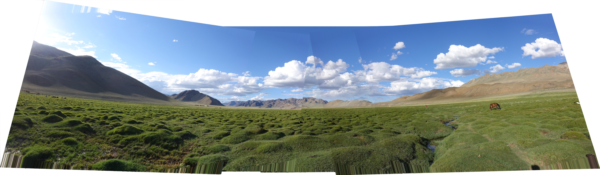
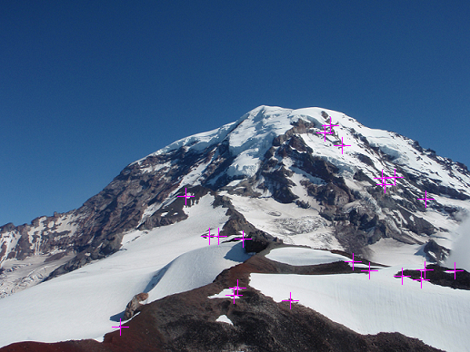
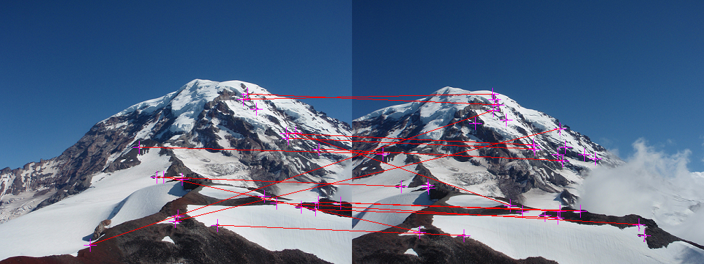
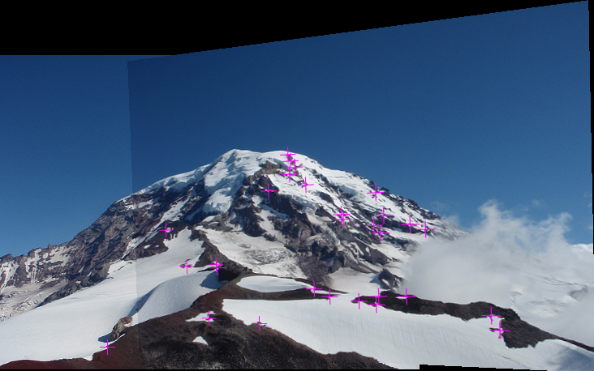

# CSE 455 Homework 2 #

Welcome friends,

It's time for assignment 2! This one may be a little harder than the last one so remember to start early and start often!

To start out this homework, copy over your `process_image.c`, `filter_image.c`, and `resize_image.c` file from hw1 to the `src` file in this homework. We will be continuing to build out your image library.

## Let's make a panorama! ##

This homework covers a lot, including finding keypoints in an image, describing those key points, matching them to those points in another image, computing the transform from one image to the other, and stitching them together into a panorama.

The high-level algorithm is already done for you! You can find it near the bottom of `src/panorama_image.c`, it looks approximately like:

    image panorama_image(image a, image b, float sigma, float thresh, int nms, float inlier_thresh, int iters, int cutoff)
    {
        // Calculate corners and descriptors
        descriptor *ad = harris_corner_detector(a, sigma, thresh, nms, &an);
        descriptor *bd = harris_corner_detector(b, sigma, thresh, nms, &bn);

        // Find matches
        match *m = match_descriptors(ad, an, bd, bn, &mn);

        // Run RANSAC to find the homography
        matrix H = RANSAC(m, mn, inlier_thresh, iters, cutoff);

        // Stitch the images together with the homography
        image comb = combine_images(a, b, H);
        return comb;
    }

So we'll find the corner points in an image using a Harris corner detector. Then we'll match together the descriptors of those corners. We'll use RANSAC to estimate a projection from one image coordinate system to the other. Finally, we'll stitch together the images using this projection.

First we need to find those corners!

## 1. Harris corner detection ##

We'll be implementing Harris corner detection as discussed in class. The basic algorithm is:

    Calculate image derivatives Ix and Iy.
    Calculate measures IxIx, IyIy, and IxIy.
    Calculate structure matrix components as weighted sum of nearby measures.
    Calculate Harris "cornerness" as estimate of 2nd eigenvalue: det(S) - α trace(S)^2, α = .06
    Run non-max suppression on response map

## 1.1 Compute the structure matrix ##

Fill in `image structure_matrix(image im, float sigma);` in `harris_image.c`. This will perform the first 3 steps of the algorithm: calculating derivatives, the corresponding measures, and the weighted sum of nearby derivative information. As discussed in class, this weighted sum can be easily computed with a Gaussian blur.

### 1.1b Optional: Make a fast smoother ###

If you want a fast corner detector you can decompose the Gaussian blur from one large 2d convolution to 2 1d convolutions. Instead of using an N x N filter you can convolve with a 1 x N filter followed by the same filter flipped to be N x 1.

Fill in `image make_1d_gaussian(float sigma)` and `image smooth_image(image im, float sigma)` to use this decomposed Gaussian smoothing.

## 1.2 Computer cornerness from structure matrix ##

Fill in `image cornerness_response(image S)`.

## 1.3 Non-maximum suppression ##

We only want local maximum responses to our corner detector so that the matching is easier. Fill in `image nms_image(image im, int w)`.

For every pixel in `im`, check every neighbor within `w` pixels (Chebyshev distance). Equivalently, check the `2w+1` window centered at each pixel. If any responses are stronger, suppress that pixel's response (set it to a very low negative number).

## 1.4 Complete the Harris detector ##

Fill in the missing sections of `descriptor *harris_corner_detector(image im, float sigma, float thresh, int nms, int *n)`. The function should return an array of descriptors for corners in the image. Code for calculating the descriptors is provided. Also, set the integer `*n` to be the number of corners found in the image.

After you complete this function you should be able to calculate corners and descriptors for an image! Try running:

    im = load_image("data/Rainier1.png")
    detect_and_draw_corners(im, 2, 50, 3)
    save_image(im, "corners")

This will detect corners using a Gaussian window of 2 sigma, a "cornerness" threshold of 100, and an nms distance of 3 (or window of 7x7). It should give you something like this:

Corners are marked with the crosses. They seem pretty sensible! Lots of corners near where snow meets rock and such. Try playing with the different values to see how the affect our corner detector.

## 2 Patch matching ##

To get a panorama we have to match up the corner detections with their appropriate counterpart in the other image. The descriptor code is already written for you. It consists of nearby pixels except with the center pixel value subtracted. This gives us some small amount of invariance to lighting conditions.

The rest of the homework takes place in `src/panorama_image.c`.

## 2.1 Distance metric ##
For comparing patches we'll use L1 distance. Squared error (L2 distance) can be problematic with outliers as we saw in class. We don't want a few rogue pixels to throw off our matching function. L1 distance (sum absolute difference) is better behaved with some outliers.

Implement float `l1_distance(float *a, float *b, int n)` between two vectors of floats. The vectors and how many values they contain is passed in.

## 2.2a Find the best matches from a to b ##

First we'll look through descriptors for `image a` and find their best match with descriptors from `image b`. Fill in the first `TODO` in `match *match_descriptors(descriptor *a, int an, descriptor *b, int bn, int *mn)`.

## 2.2b Eliminate multiple matches to the same descriptor in b  ##

Each descriptor in `a` will only appear in one match. But several of them may match with the same descriptor in `b`. This can be problematic. Namely, if a bunch of matches go to the same point there is an easy homography to estimate that just shrinks the whole image down to one point to project from `a` to `b`. But we know that's wrong. So let's just get rid of these duplicate matches and make our matches be one-to-one.

To do this, sort the matches based on distance so shortest distance is first. I've already implemented a comparator for you to use, just look up how to properly apply `qsort` if you don't know already. Next, loop through the matches in order and keep track of which elements in `b` we've seen. If we see one for a second (or third, etc.) time, throw it out! To throw it out, just shift the other elements forward in the list and then remember how many one-to-one matches we have at the end. This can be done with a single pass through the data.

Once this is done we can show the matches we discover between the images:

    a = load_image("data/Rainier1.png")
    b = load_image("data/Rainier2.png")
    m = find_and_draw_matches(a, b, 2, 50, 3)
    save_image(m, "matches")

Which gives you:

## 3. Fitting our projection to the data ##

Now that we have some matches we need to predict the projection between these two sets of points! However, this can be hard because we have a lot of noisy matches. Many of them are correct but we also have some outliers hiding in the data.

## 3.1 Projecting points with a homography ##

Implement `point project_point(matrix H, point p)` to project a point using matrix `H`. You can do this with the provided matrix library by calling `matrix_mult_matrix` (see `src/matrix.c`). Or you could pull out elements of the matrix and do the math yourself. Whatever you want! Just remember to do the proper normalization for converting from homogeneous coordinates back to image coordinates. (We talked about this in class, something with that w squiggly thing).

## 3.2a  Calculate distances between points ##

`float point_distance(point p, point q)`. L2 distance. You know the formula.

## 3.2b Calculate model inliers ##

Figure out how many matches are inliers to a model. Fill in `int model_inliers(matrix H, match *m, int n, float thresh)` to loop over the points, project using the homography, and check if the projected point is within some `thresh`old distance of the actual matching point in the other image.

Also, we want to bring inliers to the front of the list. This helps us later on with the fitting functions. Again, this should all be doable in one pass through the data.

## 3.3 Randomize the matches ##

One of the steps in RANSAC is drawing random matches to estimate a new model. One easy way to do this is randomly shuffle the array of matches and then take the first `n` elements to fit a model.

Implement the [Fisher-Yates shuffle](https://en.wikipedia.org/wiki/Fisher%E2%80%93Yates_shuffle#The_modern_algorithm) in `void randomize_matches(match *m, int n)`.

## 3.4 Fitting the homography ##

We will solve for the homography using the matrix operations discussed in class to solve equations like `M a = b`. Most of this is already implemented, you just have to fill in the matrices `M` and `b` with our match information in the first TODO in `matrix compute_homography(match *matches, int n)`.

You also have to read out the final results and populate our homography matrix. Consult the slides for details about what should go where, or derive it for yourself using the projection equations!

## 3.5 Implement RANSAC ##

Implement the RANSAC algorithm discussed in class in `matrix RANSAC(match *m, int n, float thresh, int k, int cutoff)`. Pseudocode is provided.

## 3.6 Combine the images with a homography ##

Now we have to stitch the images together with our homography! Given two images and a homography, stitch them together with `image combine_images(image a, image b, matrix H)`.

Some of this is already filled in. The first step is to figure out the bounds to the image. To do this we'll project the corners of `b` back onto the coordinate system for `a` using `Hinv`. Then we can figure out our "new" coordinates and where to put `image a` on the canvas. Paste `a` in the appropriate spot in the canvas.

Next we need to loop over pixels that might map to `image b`, perform the mapping to see if they do, and if so fill in the pixels with the appropriate color from `b`. Our mapping will likely land between pixel values in `b` so use bilinear interpolation to compute the pixel value (good thing you already implemented this!).

With all this working you should be able to create some basic panoramas:

    im1 = load_image("data/Rainier1.png")
    im2 = load_image("data/Rainier2.png")
    pan = panorama_image(im1, im2, thresh=50)
    save_image(pan, "easy_panorama")

Try out some of the other panorama creation in `trypanorama.py`. If you stitch together multiple images you should turn off the `if` statement in `panorama_image` that marks corners and draws inliers.

## Extra Credit ##

Mapping all the images back to the same coordinates is bad for large field-of-view panoramas, as discussed in class. Implement `image cylindrical_project(image im, float f)` to project an image to cylindrical coordinates and then unroll it. Then stitch together some very big panoramas. Send in your favorite. Use your own images if you want!

## More Extra Credit ##

Map images to spherical coordinates and stitch together a really big panorama! Will parts of it be upside-down??

## 4. Turn it in ##

Turn in your `harris_image.c`, `panorama_image.c`, any changes you made to `trypanorama.py` and some good panoramas you generated on canvas under Assignment 2.

